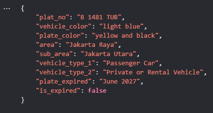
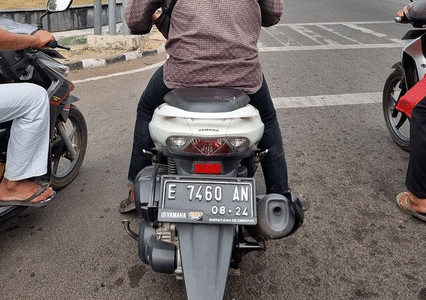
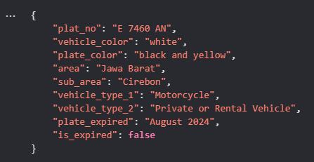
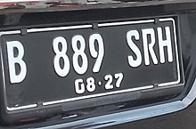
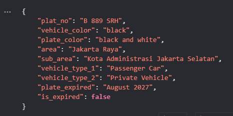

# Plate Number Detection

## About
This notebook contains code to detect plate number. The input is image file that contains plate number. The output is data that can be retrieved from the plate number. 

The following is description of the response:
- plat_no: the plate number
- vehicle_color: color  of the vehicle
- plate_color: plate number color (background and foreground)
- area: plate area based on the prefix (indonesian number plate format). refer to Regulation of the Chief of the Indonesian National Police Number 7 of 2021
- sub_area: plate area based on the prefix and postfix (indonesian number plate format). refer to Regulation of the Chief of the Indonesian National Police Number 7 of 2021
- vehicle_type_1: vehicle type based on number segment. refer to Regulation of the Chief of the Indonesian National Police Number 7 of 2021
- vehicle_type_1: vehicle type based on plate color. refer to Regulation of the Chief of the Indonesian National Police Number 7 of 2021
- plate_expired: expired date for plate. 
- is_expired': true/false. calculate from the expire date and current date.

Sample response:
```json
{
    "plat_no": "B 1481 TUB",
    "vahicle_color": "light blue",
    "plate_color": "yellow and black",
    "area": "Jakarta Raya",
    "sub_area": "Jakarta Utara",
    "vehicle_type_1": "Passenger Car",
    "vehicle_type_2": "Private or Rental Vehicle",
    "plate_expired": "June 2027",
    "is_expired": false,
    "gate_open": "N/A",
    "gate_closed": "N/A"
}
```

The following is the response when the image does not contain image:
```json
{
    "message": "The image does not contain vehicle",
}
```

## Run the .ipynb notebook
1. Start run from this line:
    ```
    !pip install -q -U google-generativeai python-dotenv
    ```
2. On the **Initialization** section, run one of section **Run in Google Collab** or **Run In Local** section. Depend on the environment you are working in. If you **Run in Google Collab**, set the key in the **secrets**. If you **Run In Local**, rename file `.env.example` to `.env` then insert your API Key. 
3. Continue run the next cell
4. on **Load File** section, select which image you want to detect. Change variable `vehicle_to_analyze` accordingly. 
5. Continue run the next cell to get the json file. 

## Experiment
### 1 - Taxi
Input:


Output:



### 2 - Bike
Input:



Output:



### 3 - Car
Input:



Output:



### 3 - Government Plate Number
Input:


Output:

